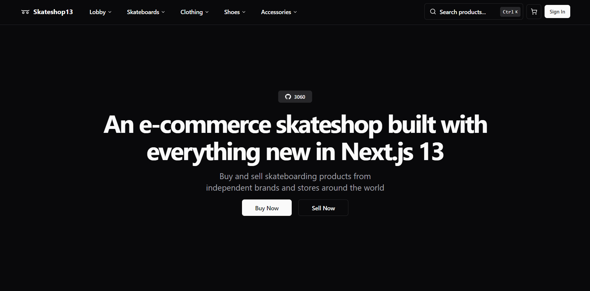

# [Skateshop13](https://skateshop.sadmn.com/)

This is an open source e-commerce skateshop build with everything new in Next.js 13. It is bootstrapped with `create-t3-app`.

[](https://skateshop.sadmn.com/)

> **Warning**
> This project is still in development and is not ready for production use.
>
> It uses new technologies (server actions, drizzle ORM) which are subject to change and may break your application.

## Tech Stack

- [Next.js](https://nextjs.org)
- [Tailwind CSS](https://tailwindcss.com)
- [Clerk Auth](https://clerk.dev)
- [Drizzle ORM](https://orm.drizzle.team)
- [React Email](https://react.email)
- [Contentlayer](https://www.contentlayer.dev)
- [uploadthing](https://uploadthing.com)
- [Stripe](https://stripe.com)

## Features to be implemented

- [x] Authentication with **Clerk**
- [x] File uploads with **uploadthing**
- [x] Newsletter subscription with **React Email** and **Resend**
- [x] Blog using **MDX** and **Contentlayer**
- [x] ORM using **Drizzle ORM**
- [x] Database on **PlanetScale**
- [x] Validation with **Zod**
- [x] Storefront with products, categories, and subcategories
- [x] Seller and customer workflows
- [x] User subscriptions with **Stripe**
- [ ] Checkout with **Stripe Checkout**
- [ ] Admin dashboard with stores, products, orders, subscriptions, and payments

## Installation

### 1. Clone the repository

```bash
git clone https://github.com/sadmann7/skateshop
```

### 2. Install dependencies

```bash
pnpm install
```

### 3. Create a `.env` file

Create a `.env` file in the root directory and add the environment variables as shown in the `.env.example` file.

### 4. Run the application

```bash
pnpm run dev
```

### 5. Push database

```bash
pnpm run db:push
```

### 6. Listen for stripe events

```bash
pnpm run stripe:listen
```

## How do I deploy this?

Follow the deployment guides for [Vercel](https://create.t3.gg/en/deployment/vercel), [Netlify](https://create.t3.gg/en/deployment/netlify) and [Docker](https://create.t3.gg/en/deployment/docker) for more information.

## License

Licensed under the MIT License. Check the [LICENSE](./LICENSE) file for details.

## Contributing

Contributions are welcome! Please open an issue if you have any questions or suggestions. Your contributions will be acknowledged.

See the [contributing guide](./CONTRIBUTING.md) for more information.

## Contributors

Thanks goes to these wonderful people for their contributions:

<p align="center">
 <a href="https://github.com/sadmann7/skateshop/graphs/contributors">
   
 </a>
</p>

<p align="center">
 Made with <a rel="noopener noreferrer" target="_blank" href="https://contrib.rocks">contrib.rocks</a>
</p>
