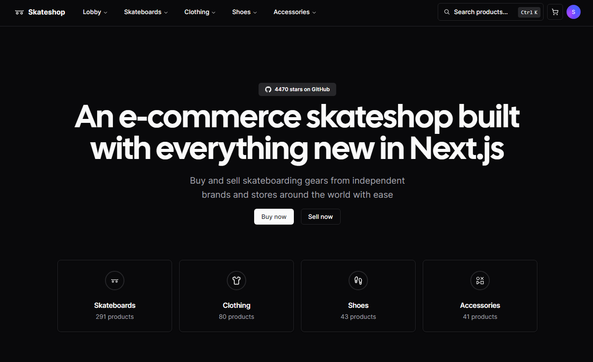

# [Skateshop](https://skateshop.sadmn.com/)

This is an open source e-commerce skateshop build with everything new in Next.js 14. It is bootstrapped with `create-t3-app`.

[](https://skateshop.sadmn.com/)

> **Warning**
> This project is still in development and is not ready for production use.
>
> It uses new technologies (drizzle ORM) which are subject to change and may break your application.

## Tech Stack

- **Framework:** [Next.js](https://nextjs.org)
- **Styling:** [Tailwind CSS](https://tailwindcss.com)
- **User Management:** [Clerk](https://clerk.com)
- **ORM:** [Drizzle ORM](https://orm.drizzle.team)
- **UI Components:** [shadcn/ui](https://ui.shadcn.com)
- **Email:** [React Email](https://react.email)
- **Content Management:** [Contentlayer](https://www.contentlayer.dev)
- **File Uploads:** [uploadthing](https://uploadthing.com)
- **Payments infrastructure:** [Stripe](https://stripe.com)

## Features to be implemented

- [x] Authentication with **Clerk**
- [x] File uploads with **uploadthing**
- [x] Newsletter subscription with **React Email** and **Resend**
- [x] Blog using **MDX** and **Contentlayer**
- [x] ORM using **Drizzle ORM**
- [x] Database on **PlanetScale**
- [x] Validation with **Zod**
- [x] Storefront with products, categories, and subcategories
- [x] Seller and customer workflows
- [x] User subscriptions with **Stripe**
- [ ] Checkout with **Stripe Checkout**
- [ ] Admin dashboard with stores, products, orders, subscriptions, and payments

## Running Locally

1. Clone the repository

   ```bash
   git clone https://github.com/sadmann7/skateshop.git
   ```

2. Install dependencies using pnpm

   ```bash
   pnpm install
   ```

3. Copy the `.env.example` to `.env` and update the variables.

   ```bash
   cp .env.example .env
   ```

4. Start the development server

   ```bash
   pnpm run dev
   ```

5. Push the database schema

   ```bash
   pnpm run db:push
   ```

6. Start the Stripe webhook listener

   ```bash
   pnpm run stripe:listen
   ```

## How do I deploy this?

Follow the deployment guides for [Vercel](https://create.t3.gg/en/deployment/vercel), [Netlify](https://create.t3.gg/en/deployment/netlify) and [Docker](https://create.t3.gg/en/deployment/docker) for more information.

## Contributing

Contributions are welcome! Please open an issue if you have any questions or suggestions. Your contributions will be acknowledged. See the [contributing guide](./CONTRIBUTING.md) for more information.

## Contributors

Thanks goes to these wonderful people for their contributions:

<p align="center">
 <a href="https://github.com/sadmann7/skateshop/graphs/contributors">
   
 </a>
</p>

<p align="center">
 Made with <a rel="noopener noreferrer" target="_blank" href="https://contrib.rocks">contrib.rocks</a>
</p>

## License

Licensed under the MIT License. Check the [LICENSE](./LICENSE.md) file for details.
